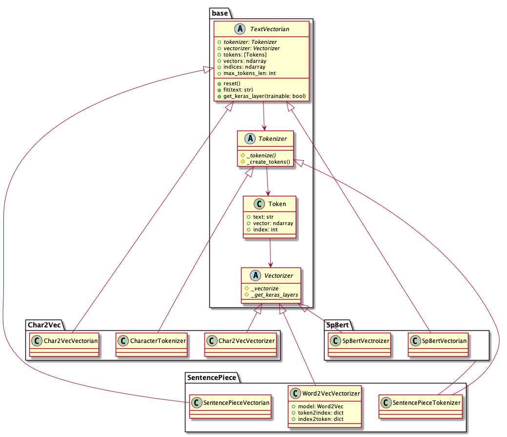

# text-vectorian

## Overview

NLP(Natural Language Processing)において、自然言語をベクトル化するためのPythonモジュールです。
TokenizerやVectorizerの詳細を気にすることなく、任意のテキストから簡単にベクトル表現を取得することが可能です。

現在提供しているTokenizer、Vectorizerの組み合わせは以下の通りです。

### SentencePiece + Word2Vec

* [SentencePiece](https://github.com/google/sentencepiece)
* [Word2Vec](https://code.google.com/archive/p/word2vec/)

それぞれ[日本語Wikipedia](https://dumps.wikimedia.org/jawiki/)を元に学習した学習済みモデルを同梱しています。

### Char2Vec

文字単位でTokenizeし、[Word2Vec](https://code.google.com/archive/p/word2vec/)でVectorizeします。
[日本語Wikipedia](https://dumps.wikimedia.org/jawiki/)を元に学習した学習済みモデルを同梱しています。

## Usage

```bash
pip install text-vectorian
```

## Examples

### ベクトルを取得する

```python
from text_vectorian import SentencePieceVectorian

vectorian = SentencePieceVectorian()
text = 'これはテストです。'
vectors = vectorian.fit(text).vectors

print(vectors)
```

```
[ -4.9867806   13.593797     0.48158574  13.635306    17.737247
    0.3811171    2.5912592   10.951708     2.45966      6.561281
    4.335961    -2.328748     0.3230163    7.5206175   12.470385
   -5.782171     6.258509     1.4046584   -5.3632765   11.03699

...

   -3.9090352    2.6152203   -2.696024     0.16026124   0.55380476
   -0.09982404  -3.8374352    2.1398337    0.8905425   -0.18653768
   -0.9730848   -0.41389456   0.54263806  -1.1963823    4.827375
    1.3883296   -0.9925082    2.4345522   -1.2879591    2.6136968 ]]
```

### Kerasで利用する

Vectroizerのモデル用のインデックスを取得し、KerasのEmbeddingレイヤーの入力として利用します。

```python
from text_vectorian import SentencePieceVectorian

vectorian = SentencePieceVectorian()
text = 'これはテストです。'
indices = vectorian.fit(text).indices

print(indices)

from keras import Input, Model
from keras.layers import Dense, LSTM

input_tensor = Input((vectorian.max_tokens_len,))
common_input = vectorian.get_keras_layer(trainable=True)(input_tensor)
l1 = LSTM(32)(common_input)
output_tensor = Dense(3)(l1)

model = Model(input_tensor, output_tensor)
model.summary()
```

```
[  14  138 2645 2389    1]

...

_________________________________________________________________
Layer (type)                 Output Shape              Param #
=================================================================
input_1 (InputLayer)         (None, 5)                 0
_________________________________________________________________
embedding_1 (Embedding)      (None, 5, 50)             8555900
_________________________________________________________________
lstm_1 (LSTM)                (None, 32)                10624
_________________________________________________________________
dense_1 (Dense)              (None, 3)                 99
=================================================================
Total params: 8,566,623
Trainable params: 8,566,623
Non-trainable params: 0
_________________________________________________________________
```

## Development

### Class



## License

* [MIT](https://github.com/lhideki/text-vectorian/blob/master/LICENSE)

## Authors

* [Hideki INOUE](https://github.com/lhideki)
